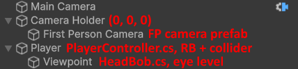

# Realistic First Person Movement for Unity

Realistic First Person Movement for Unity (RFPM4U) consists of two scripts that make walking in a 3D game much more enjoyable and immersive. This is perfect for horror games or walking sims. Some of these features can be found in AAA games like Resident Evil.

## Features

* **Walk cycle dips**
  * These are dips in move speed when a foot hits the ground.
  * Modern Resident Evil games all use this.
* **Head bob**
  * Moves in a u-shaped pattern
  * Also rotates the camera since in real life your eyes would lock onto whatever is in front of you.
  * Synced with walk cycle of course.
* **Less control over sharp turns**
  * The player has less control over move direction the higher the turn angle is between each step.
  * The walk cycle speed will increase if the player is trying to make a sharp turn, meaning the current foot will hit the ground quicker to be able to change direction.
  * The walk cycle dip will also feel stronger to give the impression of stopping momentum.
  * Feels like you're actually using your legs to rotate your body.
* **Dominant leg**
  * One leg feels very slightly stronger than the other.
  * Could potentially also be used for limping.
* **Slight randomization**
  * Some aspects such as the walk cycle interval are slightly randomized for a more natural feel.
* **SmoothDamp acceleration**
  * You don't immediately start moving at full speed.

 

<small>(Ignore the odd scene setup)</small>

## Setup

1. [Install NaughtyAttributes](https://github.com/dbrizov/NaughtyAttributes)
2. Install Cinemachine (Package Manager -> Unity Registry)
3. [Download the latest realase](https://github.com/Squirrel404/RFPM4U/releases) and import it into your project
4. Scene setup (prefab found in RFPM4U folder):

5. Insert the Viewpoint game object as tracking target on the Cinemachine Camera and press "Add Brain"

To change the controls, open the MovementInput input actions.
